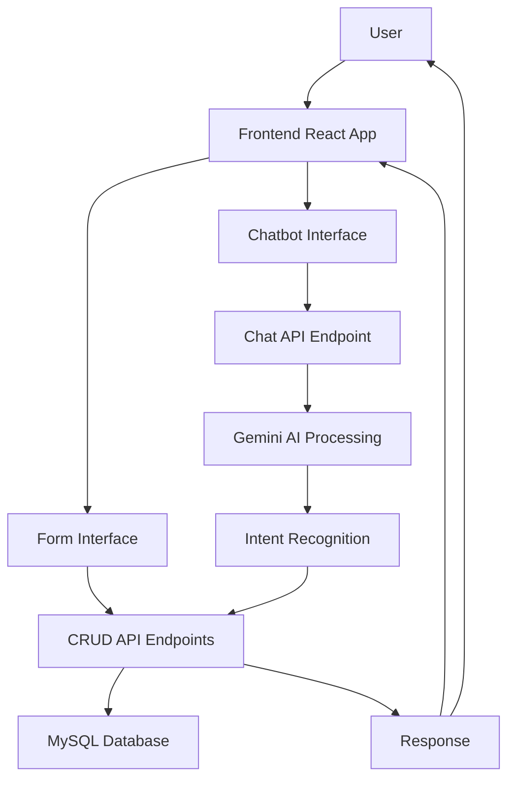

# Full-Stack CRUD Application with Gemini-Powered Chatbot

[](https://opensource.org/licenses/MIT)
[](https://nodejs.org/)
[](https://reactjs.org/)
[](https://www.mysql.com/)
[](https://developers.generativeai.google/)

A modern, production-ready full-stack web application that provides two distinct interfaces for performing CRUD operations on a user database: a traditional form-based interface and an intelligent AI-powered chatbot interface using Google's Gemini API.

## 🚀 Features

### Form-Based Interface
- **Clean, Responsive Design**: Modern UI with smooth animations and transitions
- **Complete CRUD Operations**: Create, Read, Update, and Delete users
- **Real-time Validation**: Client-side and server-side validation with helpful error messages
- **Inline Editing**: Click to edit users directly from the table view
- **Confirmation Dialogs**: Safe deletion with confirmation prompts

### AI Chatbot Interface
- **Natural Language Processing**: Powered by Google Gemini Pro LLM
- **Conversational CRUD**: Perform all database operations through natural language
- **Smart Intent Recognition**: Understands user requests in plain English
- **Confirmation System**: Asks for confirmation on destructive operations
- **Quick Actions**: Pre-defined buttons for common tasks

### Technical Features
- **RESTful API**: Well-structured API endpoints following REST principles
- **Code Reuse**: Chatbot uses the same CRUD API endpoints as the form interface
- **Error Handling**: Comprehensive error handling and user feedback
- **Responsive Design**: Works perfectly on desktop, tablet, and mobile devices
- **Real-time Updates**: Live synchronization between interfaces
- **Professional UI**: Modern gradient design with smooth animations

> **Note**: Dark/light mode toggle functionality is planned for future implementation. Currently, the application uses a modern light theme with gradient backgrounds.

## 🛠 Technology Stack

### Frontend
- **React 18**: Modern JavaScript framework with hooks
- **Webpack 5**: Module bundler with development server
- **CSS3**: Advanced styling with gradients, animations, and responsive design
- **Axios**: HTTP client for API requests

### Backend
- **Node.js**: JavaScript runtime environment
- **Express.js**: Fast, unopinionated web framework
- **MySQL**: Relational database for data persistence
- **Google Gemini AI**: Advanced language model for chatbot intelligence

### Development Tools
- **Babel**: JavaScript transpiler for modern syntax
- **Nodemon**: Development server with auto-restart
- **CORS**: Cross-origin resource sharing middleware

## 📋 Prerequisites

Before setting up the application, ensure you have the following installed:

- **Node.js** (version 16.0 or higher)
- **npm** or **yarn** package manager
- **MySQL** (version 8.0 or higher)
- **Git** (for cloning the repository)

## 🚀 Installation & Setup

### 1. Clone the Repository

```bash
git clone https://github.com/Praneel7015/crud-chatbot-app.git
cd crud-chatbot-app
```

### 2. Database Setup

#### Install and Start MySQL
Make sure MySQL is installed and running on your system.

#### Create Database and Tables
1. Log into MySQL as root or a user with database creation privileges:
```bash
mysql -u root -p
```

2. Create the database and tables by running the provided schema:
```bash
mysql -u root -p < database/schema.sql
```

Alternatively, you can copy and paste the contents of `database/schema.sql` into your MySQL client.

The schema will create:
- A database named `crud_chatbot_db`
- A `users` table with all necessary fields
- Sample data for testing

### 3. Backend Setup

#### Navigate to Backend Directory
```bash
cd backend
```

#### Install Dependencies
```bash
npm install
```

#### Configure Environment Variables
1. Create a `.env` file in the backend directory:
```bash
cp .env.example .env
```

2. Edit the `.env` file with your database credentials:
```env
# Database Configuration
DB_HOST=localhost
DB_USER=root
DB_PASSWORD=your_mysql_password
DB_NAME=crud_chatbot_db

# Server Configuration
PORT=5000
NODE_ENV=development
```

**Important**: Replace `your_mysql_password` with your actual MySQL password.

**Note**: The Google Gemini AI API key is currently hardcoded in the application for demo purposes. In a production environment, you should move this to an environment variable for security.

#### Start the Backend Server
```bash
# For development (with auto-restart)
npm run dev

# For production
npm start
```

The backend server will start on `http://localhost:5000`

### 4. Frontend Setup

#### Open a New Terminal and Navigate to Frontend Directory
```bash
cd frontend
```

#### Install Dependencies
```bash
npm install
```

#### Start the Frontend Development Server
```bash
# Start development server
npm run dev

# Or alternatively
npm start
```

The frontend application will start on `http://localhost:3000`

### 5. Verify Installation

1. **Backend Health Check**: Visit `http://localhost:5000/api/health`
   - You should see: `{"status":"OK","message":"CRUD Chatbot API is running",...}`

2. **Database Connection**: Visit `http://localhost:5000/api/users`
   - You should see a JSON response with sample users

3. **Frontend Application**: Visit `http://localhost:3000`
   - You should see the application homepage with both form and chatbot interfaces

## 🎯 Usage Guide

### Form Interface

1. **Adding Users**:
   - Fill in the required fields (Full Name, Email, Phone Number)
   - Optionally add Address and Additional Notes
   - Click "Add User" to save

2. **Viewing Users**:
   - All users are displayed in the table on the right
   - Use the "Refresh" button to reload the data

3. **Editing Users**:
   - Click the "Edit" button next to any user
   - The form will populate with their data
   - Make changes and click "Update User"

4. **Deleting Users**:
   - Click the "Delete" button next to any user
   - Confirm the deletion in the popup dialog

### Chatbot Interface

1. **Getting Started**:
   - Click on the "AI Chatbot" tab
   - Use the quick action buttons or type your own message

2. **Example Commands**:
   ```
   "Add a new user named John Doe with email john@example.com and phone 555-1234"
   "Show me all users"
   "Find users named Smith"
   "Update John's phone number to 555-9999"
   "Delete the user with email john@example.com"
   "Help me understand what you can do"
   ```

3. **Natural Language**:
   - The chatbot understands natural language
   - Be conversational: "I need to add a new contact..."
   - Ask questions: "How many users do we have?"

## 🏗 Architecture Overview

### Application Flow



### API Endpoints

#### User Management (CRUD)
- `GET /api/users` - Retrieve all users
- `GET /api/users/:id` - Retrieve specific user
- `POST /api/users` - Create new user
- `PUT /api/users/:id` - Update existing user
- `DELETE /api/users/:id` - Delete user
- `GET /api/users/search/:name` - Search users by name

#### Chatbot
- `POST /api/chat` - Process chat messages
- `POST /api/chat/confirm` - Handle confirmations

#### Health Check
- `GET /api/health` - Server status check

### Data Flow

1. **Form Interface**: Direct API calls to CRUD endpoints
2. **Chatbot Interface**: 
   - User message → Chat endpoint
   - Gemini AI processing → Intent recognition
   - Internal call to CRUD endpoints
   - Response back to user

This architecture ensures code reuse and maintains a single source of truth for all database operations.

## 🧪 Testing the Application

### Manual Testing Checklist

#### Form Interface
- [ ] Create a new user with all fields
- [ ] Create a user with only required fields
- [ ] Try to create a user with invalid email
- [ ] Try to create a user with missing required fields
- [ ] Edit an existing user
- [ ] Delete a user
- [ ] Verify table updates in real-time

#### Chatbot Interface
- [ ] Ask for help
- [ ] Request to see all users
- [ ] Create a new user via natural language
- [ ] Search for users by name
- [ ] Update a user's information
- [ ] Delete a user (should ask for confirmation)
- [ ] Try various natural language phrasings

#### Cross-Interface Testing
- [ ] Create a user in the form, verify it appears in chatbot queries
- [ ] Create a user via chatbot, verify it appears in the form table
- [ ] Test switching between interfaces

## 🐛 Troubleshooting

### Common Issues

#### Backend Won't Start
- **Check MySQL**: Ensure MySQL is running and accessible
- **Database Credentials**: Verify `.env` file has correct database credentials
- **Port Conflicts**: Make sure port 5000 is available
- **Dependencies**: Run `npm install` in the backend directory

#### Frontend Won't Start
- **Port Conflicts**: Make sure port 3000 is available
- **Dependencies**: Run `npm install` in the frontend directory
- **Build Issues**: Try deleting `node_modules` and running `npm install` again

#### Database Connection Issues
- **MySQL Service**: Ensure MySQL service is running
- **Credentials**: Double-check username, password, and database name
- **Permissions**: Ensure the MySQL user has appropriate permissions
- **Schema**: Verify the database schema was created successfully

#### Chatbot Not Responding
- **API Key**: The Gemini API key is hardcoded and should work
- **Network**: Check if the backend can reach Google's API
- **Rate Limits**: Gemini API has rate limits; wait a moment and try again

### Debug Mode

#### Backend Debugging
```bash
cd backend
DEBUG=* npm run dev
```

#### Frontend Debugging
- Open browser developer tools (F12)
- Check Console tab for JavaScript errors
- Check Network tab for failed API requests

## 📁 Project Structure

```
crud-chatbot-app/
├── backend/                    # Node.js backend
│   ├── package.json           # Backend dependencies
│   ├── server.js              # Express server setup
│   ├── .env.example           # Environment variables template
│   ├── routes/                # API route handlers
│   │   ├── users.js           # User CRUD operations
│   │   └── chat.js            # Chatbot logic
│   ├── models/                # Database models
│   │   └── User.js            # User model with MySQL queries
│   └── middleware/            # Express middleware
│       └── validation.js      # Input validation middleware
├── frontend/                  # React frontend
│   ├── package.json           # Frontend dependencies
│   ├── webpack.config.js      # Webpack configuration
│   ├── public/                # Static files
│   │   └── index.html         # HTML template
│   └── src/                   # React source code
│       ├── index.js           # Application entry point
│       ├── App.js             # Main application component
│       ├── components/        # React components
│       │   ├── UserForm.js    # User creation/editing form
│       │   ├── UserTable.js   # Users display table
│       │   └── Chatbot.js     # AI chatbot interface
│       └── styles/            # CSS styles
│           └── App.css        # Main stylesheet
├── database/                  # Database files
│   └── schema.sql             # Database schema and sample data
└── README.md                  # This documentation
```

## 🔒 Security Considerations

### Current Implementation
- Input validation on both client and server side
- SQL injection prevention through parameterized queries
- CORS configuration for cross-origin requests
- Error handling without exposing sensitive information
- **Note**: Google Gemini API key is currently hardcoded for demo purposes

### Production Recommendations
- **API Key Security**: Move the Gemini API key to environment variables
- Add authentication and authorization
- Use environment variables for all sensitive data
- Implement rate limiting for API endpoints
- Add HTTPS encryption
- Set up proper logging and monitoring
- Add input sanitization
- Implement session management
- Consider API key rotation policies
- Add request validation middleware

### Google Gemini API Key Setup (For Production)
If you want to use your own Gemini API key:

1. Get an API key from [Google AI Studio](https://makersuite.google.com/app/apikey)
2. Add it to your `.env` file:
```env
GEMINI_API_KEY=your_actual_api_key_here
```
3. Update the code in `backend/routes/chat.js` to use the environment variable:
```javascript
const genAI = new GoogleGenerativeAI(process.env.GEMINI_API_KEY);
```

**Current Demo Key**: The application includes a demo API key for immediate testing, but this should be replaced with your own key for production use.

## 🚀 Deployment

### Backend Deployment
1. Set up a cloud server (AWS, Google Cloud, etc.)
2. Install Node.js and MySQL
3. Clone the repository
4. Set up environment variables
5. Run database migrations
6. Start the application with PM2 or similar process manager

### Frontend Deployment
1. Build the production version:
```bash
cd frontend
npm run build
```
2. Serve the `dist` folder using a web server (Nginx, Apache, etc.)
3. Configure proxy for API calls

### Environment Variables for Production
```env
DB_HOST=your_production_db_host
DB_USER=your_production_db_user
DB_PASSWORD=your_production_db_password
DB_NAME=crud_chatbot_db
PORT=5000
NODE_ENV=production
```

## 🤝 Contributing

We welcome contributions to improve this CRUD chatbot application! Here's how you can help:

### Getting Started
1. Fork the repository
2. Create a feature branch (`git checkout -b feature/amazing-feature`)
3. Make your changes
4. Test your changes thoroughly
5. Commit your changes (`git commit -m 'Add some amazing feature'`)
6. Push to the branch (`git push origin feature/amazing-feature`)
7. Open a Pull Request

### Development Guidelines
- Follow the existing code style and conventions
- Add comments for complex logic
- Test both the form interface and chatbot functionality
- Ensure your changes don't break existing features
- Update documentation if needed

### Areas for Contribution
- **UI/UX Improvements**: Enhanced styling, animations, or user experience
- **Dark/Light Mode**: Implementation of theme switching functionality
- **Security Enhancements**: Better API key management, input validation
- **Testing**: Unit tests, integration tests
- **Performance**: Database optimization, caching
- **Features**: New CRUD operations, advanced search, user roles
- **Documentation**: Improved guides, tutorials, API documentation

## 📝 License

This project is licensed under the MIT License - see the [LICENSE](LICENSE) file for details.

## 📞 Support

If you encounter any issues or have questions:

1. Check the [troubleshooting section](#-troubleshooting) above
2. Search through existing [GitHub Issues](https://github.com/Praneel7015/crud-chatbot-app/issues)
3. Create a new issue with detailed information about the problem
4. Include error messages, browser console logs, and steps to reproduce

### When Reporting Issues
- **Environment**: OS, Node.js version, browser
- **Steps to Reproduce**: Clear step-by-step instructions
- **Expected Behavior**: What should happen
- **Actual Behavior**: What actually happens
- **Screenshots**: If applicable, especially for UI issues
- **Error Messages**: Complete error messages from console/logs

## 🙏 Acknowledgments

- Google Gemini AI for providing the intelligent chatbot capabilities
- React team for the excellent frontend framework
- Express.js team for the robust backend framework
- MySQL team for the reliable database system
- The open-source community for the various tools and libraries used

---

**Happy Coding! 🎉**